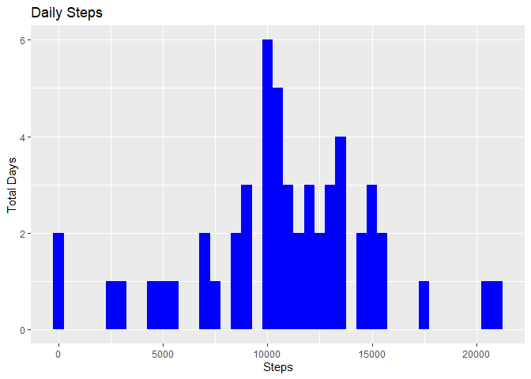
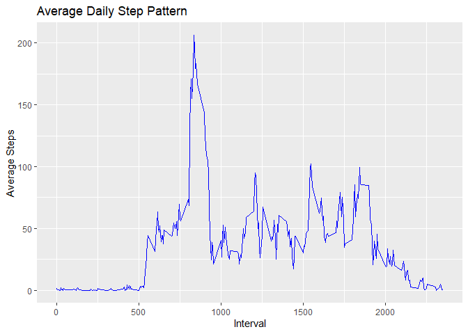
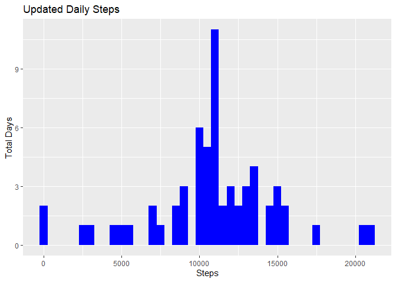
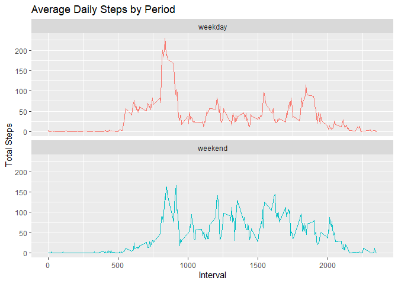

### Loading and preprocessing the data

Data is expected in a zip file called *activity.zip* in the project folder.

Load the data and tidy up the date:


```r
zipfile <- "activity.zip"
unzip(zipfile, overwrite = TRUE) 
aData <- read.csv("activity.csv", header = TRUE, sep = ",")
aData$date <- as.Date(aData$date)
```

### The total number of steps taken per day


```r
require(ggplot2)
require(dplyr)
dailyTotal <- aData %>% group_by(date) %>% summarise(steps = sum(steps, na.rm = TRUE))
overallTotal <- sum(dailyTotal$steps, na.rm = TRUE)
daysZero <- if (is.na(sum(dailyTotal$steps == 0))) 0 else sum(dailyTotal$steps == 0)
```
  
There were 570,608 steps recorded in total.  
Using the `group_by` function and removing NA values results in a '0' total being recorded against 8 monitoring days. 
  
Aggregation of non-NA values for such days results in no observations. However, we do not want to store a '0' result for these days as it is inaccurate to state that no steps were taken (all we can actually say is that no steps were *recorded*).  
  
Changing the function parameters to *include* 'NA' results overcomes the problem for this dataset and will also result in more accurate average values.


```r
dailyTotal <- aData %>% group_by(date) %>% summarise(steps = sum(steps, na.rm = FALSE))
overallTotal <- sum(dailyTotal$steps, na.rm = TRUE)
nDaysZero <- if (is.na(sum(dailyTotal$steps == 0))) 0 else sum(dailyTotal$steps == 0)
aveSteps <- data.frame(mean = mean(dailyTotal$steps, na.rm = TRUE), median = median(dailyTotal$steps, na.rm = TRUE))
ggplot(dailyTotal, aes(x = steps)) +
        geom_histogram(fill = "blue", binwidth = 500) +
        labs(title = "Daily Steps", x = "Steps", y = "Total Days")
```

<!-- -->
  
The total number of observed steps remains at 570,608 but the number of days with a total of '0' steps has reverted to 0, as demonstrated by the `Min.` of the `summary()` function:
  

```r
summary(dailyTotal$steps)
```

```
##    Min. 1st Qu.  Median    Mean 3rd Qu.    Max.    NA's 
##      41    8841   10765   10766   13294   21194       8
```
  
The mean number of daily steps is **10766** and the median is **10765**.  
  
  
### What is the average daily activity pattern?
  

```r
cleanData <- aData[complete.cases(aData), ]
intData <- tapply(cleanData$steps, cleanData$interval, mean)
intData <- data.frame(interval = as.numeric(row.names(intData)), meanSteps = intData, row.names = NULL)
maxAve <- intData[intData$meanSteps == max(intData$meanSteps), ]
ggplot(intData, aes(x = interval, y = meanSteps)) +
        geom_line(color = "blue", SIZE = 1) + 
        labs(title = "Average Daily Step Pattern", x = "Interval", y = "Average Steps")
```

<!-- -->

Here is a time series plot demonstrating the average step distribution for all days with observations.  The data is held in a data frame called `intData`.
  
The highest average step average is **206** which occurs at interval **835**.


### Imputing missing values


```r
naRows <- sum(is.na(aData$steps))
```
  
There are **2304** step observations with an `NA` result in the dataset. 

The following code creates a new version of the dataset, imputing `NA` values with the interval average from the data frame `intData`, created for the previous enquiry.
  

```r
require(dplyr)
nData <- left_join(aData, intData, by = "interval")
nData$newSteps <- nData$steps
nData$newSteps[is.na(nData$newSteps)] <- nData$meanSteps[is.na(nData$newSteps)]
```
  
If we revisit the code from the start of this paper, but swap out the dataset for the one containing imputed values then we get the following:  
  

```r
nDailyTotal <- nData %>% group_by(date) %>% summarise(newSteps = sum(newSteps, na.rm = TRUE))
nOverallTotal <- as.integer(sum(nDailyTotal$newSteps, na.rm = TRUE))
nAveSteps <- data.frame(mean = mean(nDailyTotal$newSteps, na.rm = TRUE), median = median(nDailyTotal$newSteps, na.rm = TRUE))
ggplot(nDailyTotal, aes(x = newSteps)) +
        geom_histogram(fill = "blue", binwidth = 500) +
        labs(title = "Updated Daily Steps", x = "Steps", y = "Total Days")
```

<!-- -->
  
This histogram includes the **86,129** additional steps that were added into the dataset for the 8 days that originally consisted entirely of `NA` values (taking the overall total from 570,608 to 656,737).
  
As you might expect given how we arranged the data to derive averages in part 1 of the assignment, imputing values for the 8 missing days barely affects the daily total step averages:  
  

```r
cAve <- rbind(aveSteps, nAveSteps)
row.names(cAve) <- c("before imputing", "after imputing")
cAve
```

```
##                     mean   median
## before imputing 10766.19 10765.00
## after imputing  10766.19 10766.19
```
  
### Are there differences in activity patterns between weekdays and weekends?
  
First we need to determine the weekday associated with each of the `day` values in the dataset, then we can attach a new `period` factor, which can be used to group our data later on.  The `period` value will be one of the following:  
  
* weekday  
* weekend    
  

```r
nData$day <- weekdays(nData$date)
day <- weekdays(x = as.Date(seq(7), origin = "1950-01-01"))
period <- factor(c(rep("weekday",5), rep("weekend", 2)))
dfPeriod <- data.frame(day, period)
nData <- left_join(nData, dfPeriod, by = "day")
head(nData)
```

```
##   steps       date interval meanSteps  newSteps    day  period
## 1    NA 2012-10-01        0 1.7169811 1.7169811 Monday weekday
## 2    NA 2012-10-01        5 0.3396226 0.3396226 Monday weekday
## 3    NA 2012-10-01       10 0.1320755 0.1320755 Monday weekday
## 4    NA 2012-10-01       15 0.1509434 0.1509434 Monday weekday
## 5    NA 2012-10-01       20 0.0754717 0.0754717 Monday weekday
## 6    NA 2012-10-01       25 2.0943396 2.0943396 Monday weekday
```
  
Then use this data to plot weekday vs weekend averages:  
  

```r
pData <- nData %>% 
        group_by(period, interval) %>%
        summarise(meanSteps = mean(newSteps))
ggplot(pData , aes(x = interval , y = meanSteps, color = period)) + 
        geom_line() + 
        labs(title = "Average Daily Steps by Period", x = "Interval", y = "Total Steps") + 
        facet_wrap(.~period, ncol = 1, nrow=2) +
        theme(legend.position = "none")
```

<!-- -->
  
As we can see, there are a few noticeable differences, most notably:  
  
* step averages are increased at the lower intervals for weekdays (suggesting more activity earlier in the day)  
* step averages are increased at the higher intervals for weekends (suggesting more activity later in the day)  
* on average the maximum step count is higher on a weekday  
* overall daily average is higher at a weekend.  
